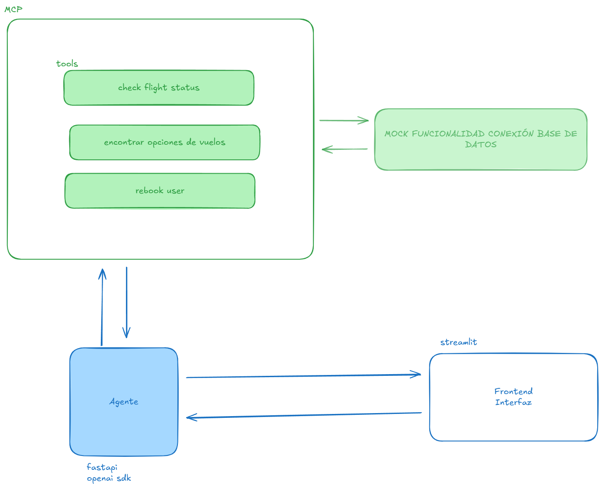

# VuelaConNosotros 🚀

Chatbot avanzado para asistencia a pasajeros ante incidencias de vuelo

---

<p align="center">
	
</p>

---

## Descripción

Este repositorio contiene una demo de agente conversacional para ayudar a pasajeros ante incidencias (cancelaciones, cambios de vuelo, etc). El proyecto está dividido en tres componentes principales:

- `mcp_vcn/` — Servicio MCP (herramientas) que expone operaciones sobre vuelos y reservas.
- `agente_vcn/` — El agente conversacional que usa las herramientas MCP y mantiene estado multi-turno.
- `interfaz/` — Demo en Streamlit que actúa como interfaz de usuario y consume el endpoint del agente.

**Objetivos clave:**
- Conversaciones multi-turno.
- Herramientas mock para consultar y modificar una base de datos simulada de aerolínea.
- Desplegable con Docker Compose para pruebas y demos rápidas.

---

## Arquitectura

La comunicación entre componentes se realiza por HTTP dentro de la red de Docker Compose. Puertos locales:

- `mcp_vcn`: **8000** (MCP HTTP server)
- `agente_vcn`: **8001** (API FastAPI `/chat`)
- `interfaz`: **8501** (Streamlit UI)

---


## Variables de entorno

Usa un archivo `.env` en la raíz del proyecto (no lo incluyas en control de versiones si contiene secretos). Ejemplo:

```env
OPENAI_API_KEY=tu_api_key_aqui
URL_MCP=http://mcp_vcn:8000/mcp
URL_CHAT=http://agente_vcn:8001/chat
```

Hay un archivo ejemplo `.env.example` en la raíz con valores por defecto.

---

## Instalación y ejecución rápida

1. **Crea el archivo `.env` en la raíz** (puedes copiar `.env.example`):

	```sh
	cp .env.example .env
	# Edita .env y añade tu clave de OpenAI
	```

2. **Levanta todos los servicios con Docker Compose:**

	```sh
	docker-compose up --build -d
	```

3. **Ver logs de un servicio (ejemplo):**

	```sh
	docker-compose logs -f agente_vcn
	```

4. **Abre la interfaz Streamlit en el navegador:**

	[http://localhost:8501](http://localhost:8501)

5. **Probar el endpoint del agente (opcional):**

	```sh
	curl -X POST http://localhost:8001/chat -H "Content-Type: application/json" -d '{"message": "Hola"}'
	```

---

## Notas por servicio

- **mcp_vcn**: expone herramientas MCP (consultas y reservas). Servicio "mock" con utilidades locales y BD simulada.
- **agente_vcn**: instancia un Agent y conecta un cliente HTTP al MCP (`URL_MCP`). Expone `/chat` con `output` y metadatos.
- **interfaz**: demo en Streamlit. Busca `CHAT_URL` o `URL_CHAT` en el entorno. Envía `{"message": ...}` al endpoint y muestra sólo el campo `output`.

---

## Consejos y buenas prácticas

- No pongas claves reales en el repo. Usa `.env` local o secretos en tu entorno de despliegue.
- Para desarrollo rápido, puedes ejecutar servicios localmente con virtualenv y dependencias de `pyproject.toml`.
- `docker-compose` usa nombres de servicio como hostname dentro de la red (por ej. `mcp_vcn`).

---

## Problemas comunes y depuración

- **El agente devuelve 503:** revisa logs del contenedor `agente_vcn` y asegúrate de que `mcp_vcn` está en marcha y accesible.
- **Streamlit no conecta:** verifica que `URL_CHAT` apunte al endpoint correcto (desde el contenedor `interfaz` debe resolver `agente_vcn`).
- **Errores con claves de OpenAI:** asegúrate de que `OPENAI_API_KEY` está en el `.env` y accesible para el contenedor del agente.

---

## Extensiones y siguientes pasos

- Añadir tests automáticos para MCP y el endpoint `/chat`.
- Añadir script de inicialización de datos (poblar BD mock) y documentarlo.
- Implementar healthchecks y dependencias en `docker-compose` para readiness.

---

## Contacto y licencia

Este repositorio es una demo; la licencia está en `LICENSE`.

---


