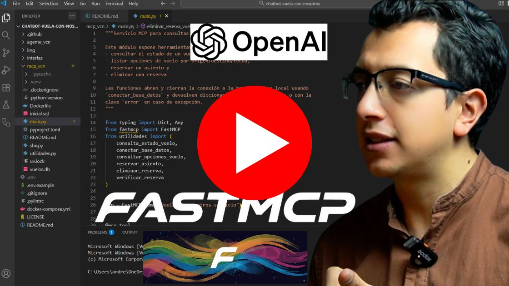
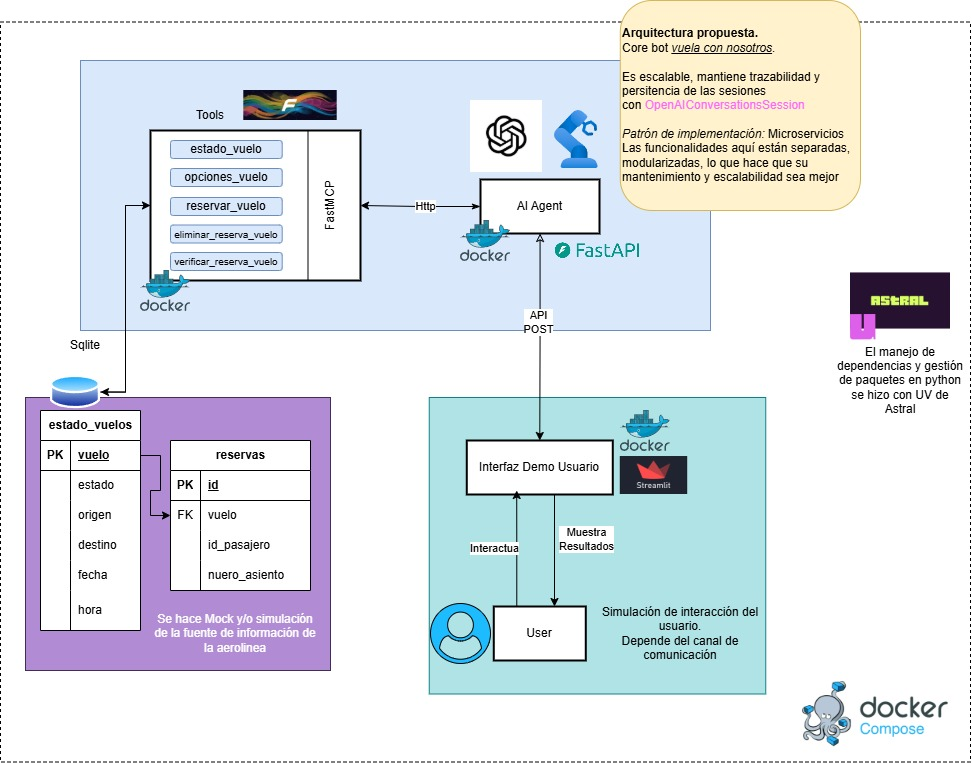

# VuelaConNosotros 🚀

Agente conversacional proactivo para atención al cliente de aerolíneas

<p align="center">
	<a href="https://youtu.be/KGL0nZnaZ8o" target="_blank">
		
	</a>
</p>

---

## ¿Por qué VuelaConNosotros?

- **Proactividad real:** El agente detecta cancelaciones y toma la iniciativa, guiando al pasajero en todo momento.
- **Conversaciones multi-turno inteligentes:** Mantiene el contexto y el estado de la conversación, adaptándose a interrupciones y redirigiendo hábilmente al objetivo principal.
- **Integración modular:** Arquitectura clara y escalable, lista para conectar con sistemas reales de la aerolínea. Las herramientas mock permiten simular consultas y reservas, facilitando pruebas y futuras integraciones.
- **Resiliencia y robustez:** El sistema está preparado para manejar preguntas fuera de contexto, errores y cambios inesperados, asegurando una experiencia fluida y confiable.
- **Despliegue ágil:** Docker Compose permite levantar toda la solución en minutos, ideal para demos, pruebas y desarrollo colaborativo.

---

## Arquitectura de la Solución

<p align="center">
	
</p>

La solución se compone de tres módulos principales, cada uno con responsabilidades bien definidas:

- `mcp_vcn/` — Servicio MCP que simula operaciones sobre vuelos y reservas.
- `agente_vcn/` — El cerebro conversacional, que gestiona el estado y orquesta la resolución de incidencias.
- `interfaz/` — Demo visual en Streamlit, pensada para mostrar la experiencia de usuario final.

La comunicación entre componentes se realiza por HTTP dentro de la red de Docker Compose, facilitando la escalabilidad y la integración futura con otros sistemas. Puertos locales:

- `mcp_vcn`: **8000** (MCP HTTP server)
- `agente_vcn`: **8001** (API FastAPI `/chat`)
- `interfaz`: **8501** (Streamlit UI)

---

## Instalación y Ejecución

1. Copia el archivo `.env.example` a `.env` y añade tu clave de OpenAI.
2. Ejecuta `docker-compose up --build -d` para levantar todos los servicios.
3. Accede a la interfaz en [http://localhost:8501](http://localhost:8501).

Más detalles en la sección de instalación.

Ejemplo de archivo `.env`:

```env
OPENAI_API_KEY=tu_api_key_aqui
URL_MCP=http://mcp_vcn:8000/mcp
URL_CHAT=http://agente_vcn:8001/chat
```

---

## Ejemplo de Flujo Conversacional

El agente detecta una cancelación y contacta al usuario:

> **Agente:** "Hola, lamentamos informarte que tu vuelo ha sido cancelado. ¿Te gustaría ver opciones alternativas?"
> **Usuario:** "¿Por qué se canceló?"
> **Agente:** "El vuelo fue cancelado por condiciones climáticas. ¿Te ayudo a encontrar una nueva reserva?"
> **Usuario:** "Sí, por favor."
> **Agente:** "He encontrado dos opciones para ti: vuelo a las 18:00 o a las 20:30. ¿Cuál prefieres?"

El agente mantiene el foco, responde dudas y guía al usuario hasta la resolución.

---

## Ventajas y Evolución

- **Escalabilidad:** La arquitectura modular permite añadir nuevas funcionalidades y herramientas sin afectar el núcleo conversacional.
- **Facilidad de integración:** Listo para conectar con APIs reales y sistemas de la aerolínea.
- **Extensible:** Ideal para incorporar analítica, personalización avanzada y nuevos canales de comunicación.

---

## Justificación de Diseño

- **Separación de responsabilidades:** Cada módulo cumple una función específica, facilitando el mantenimiento y la evolución.
- **Patrones modernos:** Uso de FastAPI, Streamlit y Docker para máxima flexibilidad y adopción en entornos empresariales.
- **Código limpio y legible:** Pensado para equipos de desarrollo que valoran la calidad y la escalabilidad.

---

## Próximos pasos

- Añadir tests automáticos y healthchecks.
- Integrar sistemas reales y ampliar capacidades.

---

## Contacto y licencia

Este repositorio es una demo; la licencia está en `LICENSE`.

---


